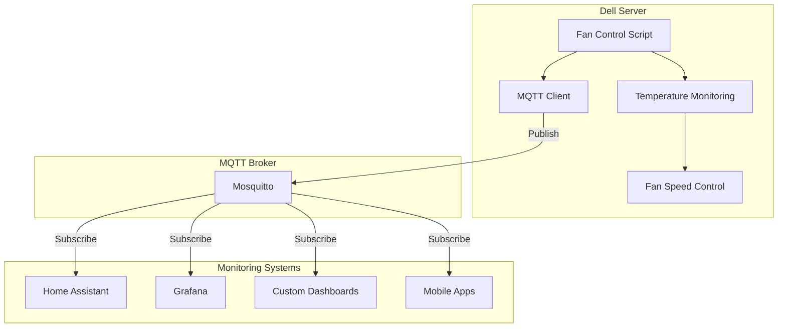
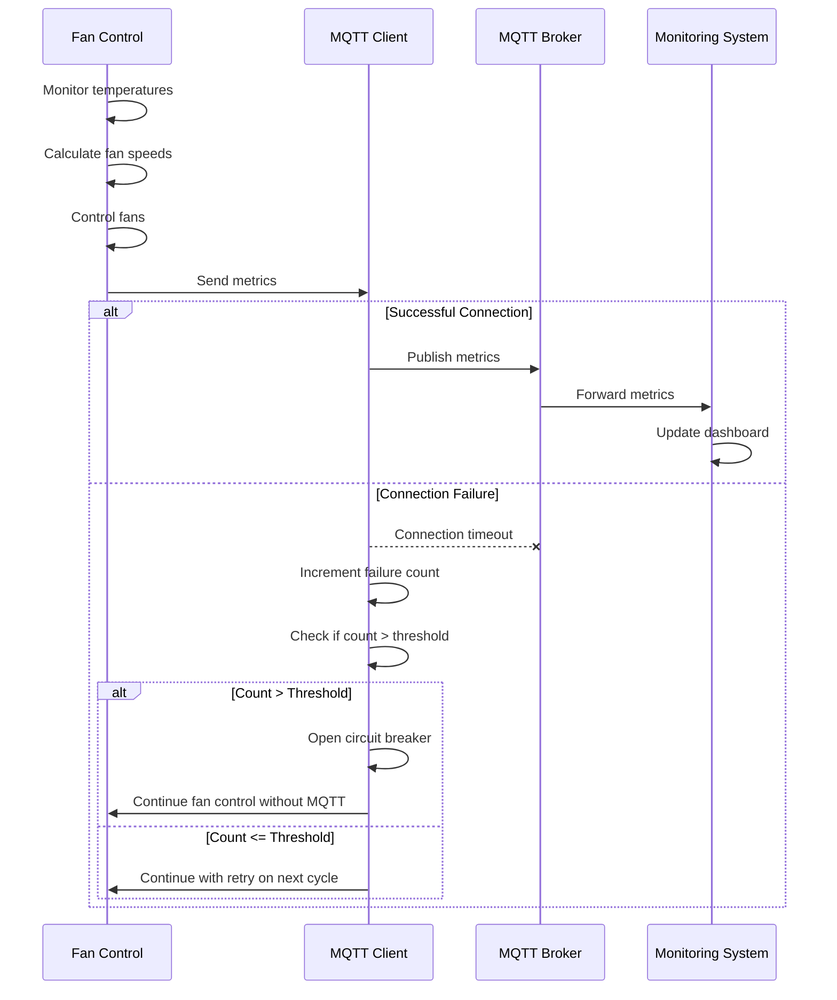
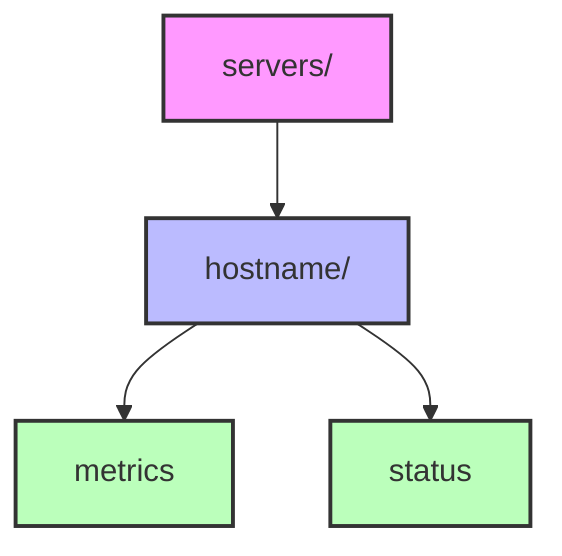
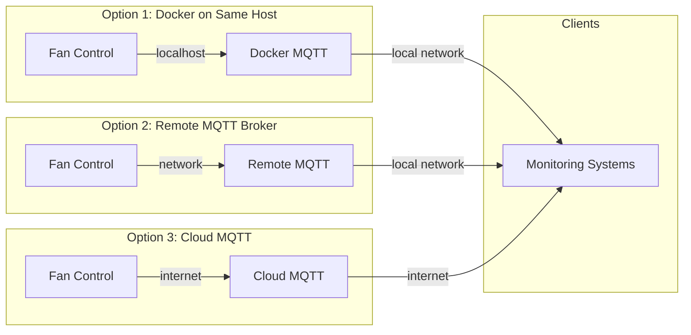
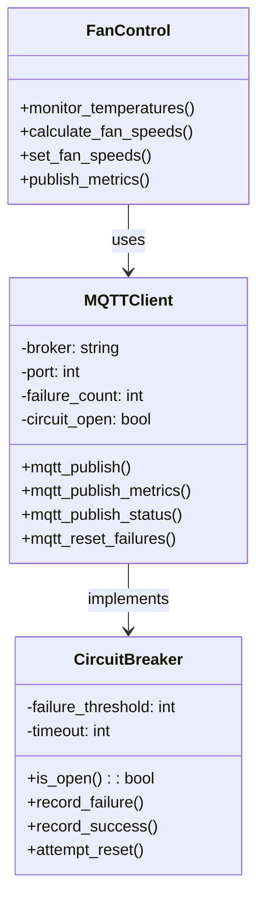
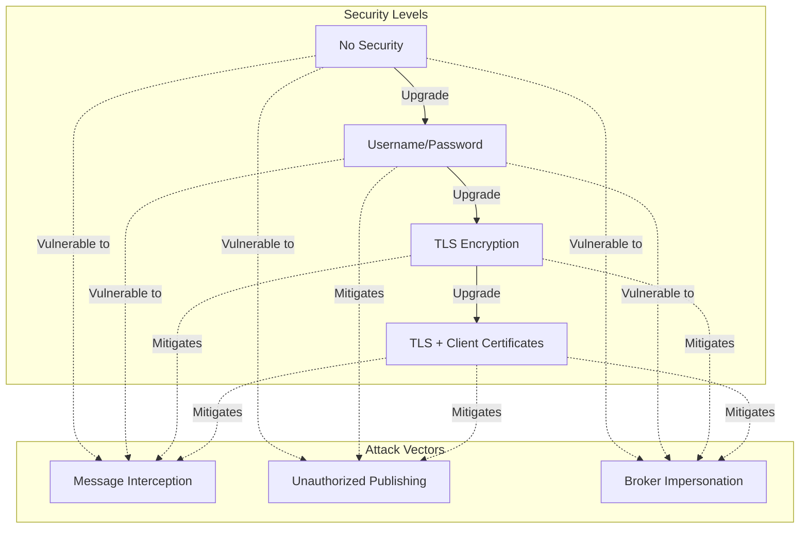

# MQTT Architecture for Dell Server Fan Control

This document provides a visual overview of the MQTT integration architecture for the Dell Server Fan Control system.

## System Architecture



## Message Flow



## Circuit Breaker Pattern

```mermaid
stateDiagram-v2
    [*] --> Closed
    
    state Closed {
        [*] --> Operational
        Operational --> Failed: Connection Failure
        Failed --> Operational: Successful Connection
        Failed --> CircuitOpen: Failure Count > Threshold
    }
    
    state Open {
        [*] --> Disabled
        Disabled --> AttemptReset: Random Interval
        AttemptReset --> Disabled: Connection Failure
        AttemptReset --> HalfOpen: Successful Connection
    }
    
    Closed --> Open: Circuit Opens
    Open --> Closed: Circuit Closes
    
    state HalfOpen {
        [*] --> Testing
        Testing --> Closed: Successful Connection
        Testing --> Open: Connection Failure
    }
```

## Topic Structure



## Deployment Options



## Component Interaction



## Security Model


