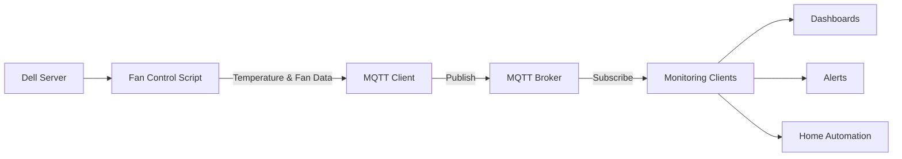
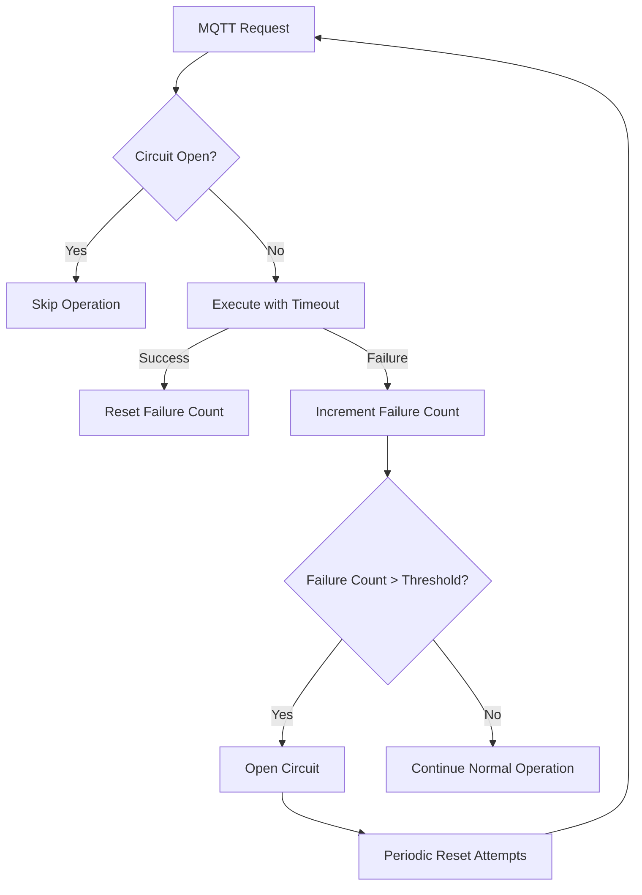

# MQTT Deployment Guide for Dell Server Fan Control

This guide provides instructions for setting up MQTT integration with the Dell Server Fan Control system. MQTT enables remote monitoring of fan speeds, temperatures, and system status.

## Table of Contents

- [Architecture Overview](#architecture-overview)
- [Docker Setup](#docker-setup)
  - [Simple Docker Run](#simple-docker-run)
  - [Docker Compose Setup](#docker-compose-setup)
- [Existing MQTT Server](#existing-mqtt-server)
- [Configuration](#configuration)
- [Message Format](#message-format)
- [Testing & Verification](#testing--verification)
- [Troubleshooting](#troubleshooting)
- [Security Considerations](#security-considerations)

## Architecture Overview



The Dell Server Fan Control system publishes two types of messages:
1. **Metrics**: Regular updates with temperature and fan speed data
2. **Status**: Important state changes and events

The system implements a circuit breaker pattern to ensure MQTT issues don't affect core fan control functionality:



## Docker Setup

### Simple Docker Run

The easiest way to set up an MQTT broker is using the Eclipse Mosquitto Docker image:

```bash
# Create directories for persistence
mkdir -p ~/mosquitto/config ~/mosquitto/data ~/mosquitto/log

# Create a basic configuration file
cat > ~/mosquitto/config/mosquitto.conf << EOF
listener 1883
allow_anonymous true
persistence true
persistence_location /mosquitto/data/
log_dest file /mosquitto/log/mosquitto.log
EOF

# Run the Mosquitto container
docker run -d --name mqtt-broker \
  -p 1883:1883 \
  -v ~/mosquitto/config:/mosquitto/config \
  -v ~/mosquitto/data:/mosquitto/data \
  -v ~/mosquitto/log:/mosquitto/log \
  eclipse-mosquitto

# Verify the container is running
docker ps --filter "name=mqtt-broker"
```

### Docker Compose Setup

For a more maintainable setup, use Docker Compose:

```bash
# Create a docker-compose.yml file
mkdir -p ~/mqtt-broker
cat > ~/mqtt-broker/docker-compose.yml << EOF
version: '3'

services:
  mosquitto:
    image: eclipse-mosquitto
    container_name: mqtt-broker
    ports:
      - "1883:1883"
      - "9001:9001"
    volumes:
      - ./config:/mosquitto/config
      - ./data:/mosquitto/data
      - ./log:/mosquitto/log
    restart: unless-stopped

volumes:
  config:
  data:
  log:
EOF

# Create directories and configuration
mkdir -p ~/mqtt-broker/config ~/mqtt-broker/data ~/mqtt-broker/log
cat > ~/mqtt-broker/config/mosquitto.conf << EOF
listener 1883
allow_anonymous true
persistence true
persistence_location /mosquitto/data/
log_dest file /mosquitto/log/mosquitto.log
EOF

# Start the container
cd ~/mqtt-broker
docker-compose up -d

# Check logs
docker-compose logs
```

## Existing MQTT Server

If you already have an MQTT broker (like Home Assistant, AWS IoT, or a standalone Mosquitto server), you can use it with the fan control system.

### Required Information

- Broker hostname or IP address
- Port (typically 1883 for unencrypted, 8883 for TLS)
- Username and password (if authentication is enabled)
- TLS certificates (if TLS is enabled)

### Cloud MQTT Services

For cloud-based MQTT brokers:

1. **AWS IoT Core**:
   - Create a "Thing" in AWS IoT
   - Generate and download certificates
   - Configure endpoint and certificates in config.env

2. **CloudMQTT**:
   - Create an instance
   - Note the server, port, username, and password
   - Configure in config.env

## Configuration

Edit the `config.env` file to enable MQTT integration:

```bash
# MQTT Settings
MQTT_BROKER="localhost"        # MQTT broker hostname or IP address
MQTT_PORT="1883"               # MQTT broker port (default: 1883, TLS: 8883)
MQTT_USER=""                   # MQTT username (optional)
MQTT_PASS=""                   # MQTT password (optional)
MQTT_TLS="n"                   # Enable TLS encryption (y/n)
MQTT_CA_CERT=""                # Path to CA certificate file (for TLS)
MQTT_CLIENT_CERT=""            # Path to client certificate file (for TLS)
MQTT_CLIENT_KEY=""             # Path to client key file (for TLS)
MQTT_TIMEOUT="3"               # Timeout in seconds for MQTT connections
MQTT_MAX_FAILURES="3"          # Max consecutive failures before disabling MQTT
```

### Docker Configuration

If using the Docker setup on the same machine:

```bash
MQTT_BROKER="localhost"
MQTT_PORT="1883"
```

If the Docker container is on a different machine:

```bash
MQTT_BROKER="192.168.1.100"  # Replace with the IP of the Docker host
MQTT_PORT="1883"
```

### Authentication Configuration

For a broker with authentication:

```bash
MQTT_USER="fancontrol"
MQTT_PASS="your-secure-password"
```

### TLS Configuration

For a broker with TLS encryption:

```bash
MQTT_TLS="y"
MQTT_CA_CERT="/path/to/ca.crt"
MQTT_CLIENT_CERT="/path/to/client.crt"  # If using client certificates
MQTT_CLIENT_KEY="/path/to/client.key"   # If using client certificates
```

## Message Format

The fan control system publishes two types of messages:

### 1. Metrics Messages

Published to: `servers/{hostname}/metrics`

Example payload:
```json
{
  "timestamp": 1679395200,
  "hostname": "dell-server",
  "status": "normal",
  "cpu_temps": [45, 47, 46, 44],
  "gpu_temps": [52],
  "base_fan_percent": 35,
  "gpu_fan_percent": 45,
  "gpu_fans": [5, 6],
  "pid": 12345
}
```

### 2. Status Messages

Published to: `servers/{hostname}/status`

Example payload:
```json
{
  "timestamp": 1679395260,
  "hostname": "dell-server",
  "status": "warning",
  "message": "GPU temperature approaching threshold: 72°C"
}
```

## Testing & Verification

### Docker-based Testing

To verify your MQTT setup is working correctly:

```bash
# Subscribe to all messages from your server
docker exec mqtt-broker mosquitto_sub -v -t "servers/#"

# In another terminal, manually publish a test message
docker exec mqtt-broker mosquitto_pub -t "servers/test" -m "Hello from Dell Fan Control"
```

### External Server Testing

For testing with an external MQTT server:

```bash
# Install mosquitto clients if needed
sudo apt-get install mosquitto-clients

# Subscribe to messages
mosquitto_sub -h your-mqtt-broker -p 1883 -t "servers/#" -v

# For servers with authentication
mosquitto_sub -h your-mqtt-broker -p 1883 -u username -P password -t "servers/#" -v

# For TLS-enabled servers
mosquitto_sub -h your-mqtt-broker -p 8883 --tls-version tlsv1.2 \
  --cafile /path/to/ca.crt -t "servers/#" -v
```

### Verifying Fan Control Integration

1. Enable MQTT in config.env
2. Restart the fan control service
3. Subscribe to the metrics topic
4. You should see regular updates with temperature and fan data

```bash
# Restart the fan control service
sudo systemctl restart dell_ipmi_fan_control

# Subscribe to metrics
mosquitto_sub -h localhost -t "servers/$(hostname)/metrics" -v
```

## Troubleshooting

### Common Docker Issues

1. **Container won't start**
   - Check for port conflicts: `sudo lsof -i :1883`
   - Verify directory permissions: `ls -la ~/mosquitto`
   - Check Docker logs: `docker logs mqtt-broker`

2. **Can't connect to broker**
   - Verify the container is running: `docker ps`
   - Check network settings: `docker inspect mqtt-broker | grep IPAddress`
   - Test local connectivity: `telnet localhost 1883`

3. **Permission issues with volumes**
   - Fix permissions: `sudo chown -R 1883:1883 ~/mosquitto/`

### Connection Issues

1. **Timeout errors**
   - Increase MQTT_TIMEOUT in config.env
   - Check network connectivity: `ping your-mqtt-broker`
   - Verify firewall settings: `sudo iptables -L | grep 1883`

2. **Authentication failures**
   - Verify username and password
   - Check broker logs for auth errors
   - Test with mosquitto_pub: `mosquitto_pub -h broker -u user -P pass -t test -m test`

3. **TLS certificate issues**
   - Verify certificate paths and permissions
   - Check certificate expiration: `openssl x509 -in cert.pem -text -noout | grep "Not After"`
   - Test TLS connection: `openssl s_client -connect broker:8883`

### Circuit Breaker Recovery

If MQTT publishing is disabled due to consecutive failures:

1. Check the logs for: `MQTT publishing disabled after X consecutive failures`
2. Fix the underlying connection issue
3. The system will automatically attempt to reconnect periodically
4. Force a reset by restarting the service: `sudo systemctl restart dell_ipmi_fan_control`

## Security Considerations

### Minimal Security Setup

For basic security:

```bash
# Create a password file
mkdir -p ~/mosquitto/config
touch ~/mosquitto/config/passwd

# Add a user (you'll be prompted for a password)
docker exec -it mqtt-broker mosquitto_passwd -c /mosquitto/config/passwd fancontrol

# Update mosquitto.conf
cat > ~/mosquitto/config/mosquitto.conf << EOF
listener 1883
allow_anonymous false
password_file /mosquitto/config/passwd
persistence true
persistence_location /mosquitto/data/
log_dest file /mosquitto/log/mosquitto.log
EOF

# Restart the container
docker restart mqtt-broker
```

Update config.env:
```bash
MQTT_USER="fancontrol"
MQTT_PASS="your-secure-password"
```

### Production Hardening Recommendations

For production environments:

1. **Enable TLS encryption**
   ```bash
   # Generate certificates (simplified example)
   mkdir -p ~/mosquitto/certs
   cd ~/mosquitto/certs
   openssl req -new -x509 -days 365 -extensions v3_ca -keyout ca.key -out ca.crt
   
   # Update mosquitto.conf
   cat > ~/mosquitto/config/mosquitto.conf << EOF
   listener 8883
   allow_anonymous false
   password_file /mosquitto/config/passwd
   persistence true
   persistence_location /mosquitto/data/
   log_dest file /mosquitto/log/mosquitto.log
   cafile /mosquitto/certs/ca.crt
   certfile /mosquitto/certs/server.crt
   keyfile /mosquitto/certs/server.key
   require_certificate false
   EOF
   ```

2. **Restrict network access**
   - Run on a private network
   - Use firewall rules to limit access
   - Consider using a reverse proxy with authentication

3. **Regular updates**
   - Keep the Mosquitto image updated: `docker pull eclipse-mosquitto`
   - Rotate certificates and passwords periodically

4. **Monitoring**
   - Set up alerts for failed connection attempts
   - Monitor broker resource usage
   - Implement log rotation for MQTT broker logs
