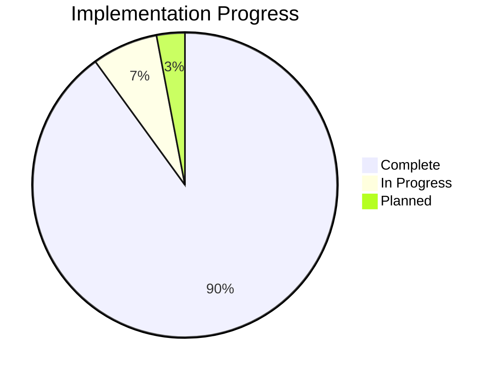

# Progress: Dell Server Fan Control

## Current Status

The Dell Server Fan Control project is currently in a **stable, production-ready state** with version 1.1.0 released on February 14, 2024. The system is fully functional for its core purpose of controlling Dell server fans based on CPU and GPU temperatures.

### Overall Progress: 90%

## What Works

### Core Functionality: 100%

- ✅ **CPU Temperature Monitoring**
  - Multiple CPU detection and monitoring
  - Highest temperature selection for fan control
  - Error handling for sensor failures

- ✅ **GPU Temperature Monitoring**
  - Automatic NVIDIA GPU detection
  - Multiple GPU support
  - Graceful fallback when GPU monitoring fails

- ✅ **Fan Control Algorithm**
  - Linear interpolation between min/max temperature points
  - Minimum fan speed enforcement
  - Hysteresis to prevent oscillation
  - Zone-based cooling for GPU-specific fans

- ✅ **System Integration**
  - Systemd service implementation
  - Automatic startup and shutdown
  - Proper signal handling
  - Default fan control restoration on exit

- ✅ **Configuration System**
  - Environment variable-based configuration
  - Dynamic configuration reloading
  - Configuration validation
  - Sensible defaults

- ✅ **Safety Features**
  - Emergency shutdown at critical temperatures
  - Validation of temperature readings
  - Error detection and handling
  - Fallback to Dell default control on critical errors

### Installation and Management: 100%

- ✅ **Installation Script**
  - Dependency checking and installation
  - Hardware detection
  - Configuration setup
  - Service installation

- ✅ **Uninstallation Script**
  - Clean removal of all components
  - Configuration backup
  - Restoration of Dell default fan control

- ✅ **Logging System**
  - Timestamped log entries
  - Different log levels (normal, warning, error)
  - Log rotation
  - Status reporting

## In Progress

### Documentation: 80%

- ✅ README with installation and basic usage
- ✅ Configuration documentation
- ✅ Basic troubleshooting guide
- ⏳ Detailed examples for different server models
- ⏳ Advanced configuration scenarios
- ⏳ Performance tuning guidelines

### Testing: 75%

- ✅ Testing on R730xd
- ✅ Testing with NVIDIA GPUs
- ✅ Testing under various load conditions
- ⏳ Testing on additional Dell server models
- ⏳ Long-term stability testing
- ⏳ Edge case testing

### Error Handling: 85%

- ✅ Basic error detection and recovery
- ✅ Graceful shutdown on critical errors
- ✅ Configuration validation
- ⏳ More sophisticated recovery strategies
- ⏳ Improved error reporting

## What's Left to Build

### Short-term Improvements: 25%

- ✅ MQTT-based remote monitoring for metrics and status
- ⏳ Email notifications for critical events
- ⏳ Improved log management
- ⏳ Fan testing/identification mode

### Medium-term Features: 0%

- 🔲 Web-based configuration interface
- 🔲 Time-based fan profiles
- 🔲 Additional sensor support
- 🔲 Configuration presets
- 🔲 Temperature trend analysis

### Long-term Vision: 0%

- 🔲 Support for non-Dell servers
- 🔲 Advanced fan curve options
- 🔲 Integration with system load monitoring
- 🔲 Comprehensive dashboard
- 🔲 Predictive temperature management

## Known Issues

### Critical Issues: None

There are currently no known critical issues that prevent the system from functioning as intended.

### Moderate Issues

1. **Fan Speed Oscillation in Certain Conditions**
   - **Description**: Some users report fan speed oscillation with certain hardware configurations
   - **Workaround**: Increase hysteresis settings (HYST_WARMING and HYST_COOLING)
   - **Status**: Under investigation

2. **iDRAC Credential Security**
   - **Description**: iDRAC credentials stored in plain text configuration file
   - **Workaround**: Ensure restricted file permissions on config.env
   - **Status**: Investigating more secure alternatives

### Minor Issues

1. **Fan Identification Challenges**
   - **Description**: Users have difficulty identifying which fans correspond to which components
   - **Workaround**: Documentation provides general guidance based on common server layouts
   - **Status**: Planning a test mode that cycles through fans individually

2. **Limited GPU Temperature Granularity**
   - **Description**: nvidia-smi provides whole-number temperature readings only
   - **Workaround**: None needed, hysteresis settings compensate for this limitation
   - **Status**: Accepted limitation of nvidia-smi tool

3. **Log File Growth**
   - **Description**: Log files can grow large over time
   - **Workaround**: Manually rotate or delete old logs
   - **Status**: Planning improved log rotation

## Testing Status

### Tested Environments

| Environment | Status | Notes |
|-------------|--------|-------|
| Dell R730xd | ✅ Fully Tested | Primary development platform |
| Debian/Proxmox | ✅ Fully Tested | Primary target OS |
| Ubuntu Server | ✅ Partially Tested | Limited testing performed |
| NVIDIA Tesla GPUs | ✅ Tested | Confirmed working |
| NVIDIA GeForce GPUs | ✅ Partially Tested | Limited models tested |
| Multiple CPUs | ✅ Tested | Confirmed working |

### Test Scenarios

| Scenario | Status | Notes |
|----------|--------|-------|
| Normal operation | ✅ Passed | System maintains appropriate fan speeds |
| High CPU load | ✅ Passed | Fans increase appropriately under load |
| High GPU load | ✅ Passed | GPU-specific fans increase as needed |
| Configuration changes | ✅ Passed | Changes apply without restart |
| Service restart | ✅ Passed | Properly restores state |
| Error recovery | ⏳ Partially Tested | More testing needed for edge cases |
| Long-term stability | ⏳ In Progress | Initial results positive |

## Deployment Status

The system is currently deployed in production environments by multiple users. Feedback has been generally positive, with users reporting:

- Significant noise reduction compared to default Dell fan control
- Proper temperature management under various loads
- Reliable operation over extended periods
- Successful adaptation to different hardware configurations

## Next Milestones

| Milestone | Target | Status |
|-----------|--------|--------|
| Version 1.1.1 | Q2 2024 | 🔲 Planned |
| Enhanced Documentation | Q2 2024 | ⏳ In Progress |
| Additional Hardware Testing | Ongoing | ⏳ In Progress |
| Web Interface (v1.2.0) | Q3 2024 | 🔲 Planned |
| Advanced Monitoring (v1.3.0) | Q4 2024 | 🔲 Planned |
