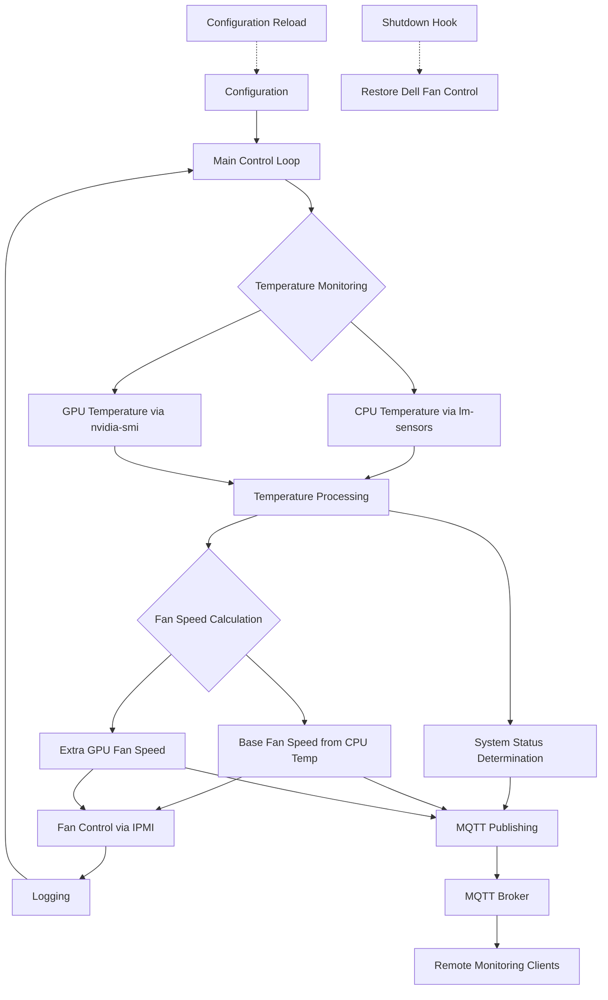
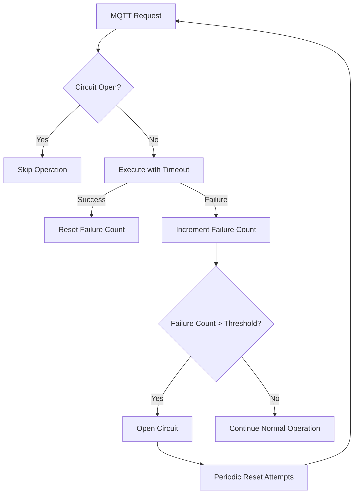
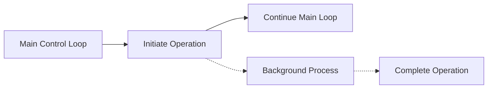

# System Patterns: Dell Server Fan Control

## System Architecture

The Dell Server Fan Control system follows a simple but effective architecture:



## Core Design Patterns

### 1. Monitor-Control Loop Pattern

The system implements a continuous monitoring and control loop:
- Monitor temperatures
- Calculate required fan speeds
- Adjust fan speeds
- Log status
- Sleep for defined interval
- Repeat

This pattern ensures responsive adaptation to changing thermal conditions while maintaining system stability.

### 2. Threshold-Based Control with Hysteresis

To prevent rapid fan speed oscillations, the system implements hysteresis:
- Fan speeds only increase when temperature rises by HYST_WARMING degrees
- Fan speeds only decrease when temperature falls by HYST_COOLING degrees
- This creates a "dead band" where small temperature fluctuations don't trigger fan speed changes


### 3. Linear Interpolation for Fan Speed Calculation

Fan speeds are calculated using linear interpolation between minimum and maximum temperature points:

```
fan_percent = ((current_temp - min_temp) * 100) / (max_temp - min_temp)
```

This creates a proportional response where:
- At or below MIN_TEMP: Fan speed = 0% (or FAN_MIN if higher)
- At or above MAX_TEMP: Fan speed = 100%
- Between MIN_TEMP and MAX_TEMP: Fan speed scales linearly

### 4. Layered Fan Control

The system implements a layered approach to fan control:
1. **Base Layer**: All fans respond to CPU temperature
2. **GPU Layer**: GPU-designated fans receive additional speed when GPU requires more cooling than CPU

This ensures the entire system receives adequate cooling while providing targeted cooling for GPU components.

### 5. Fail-Safe Design

The system incorporates multiple fail-safe mechanisms:
- Validation of temperature readings before taking control
- Minimum fan speed enforcement
- Emergency shutdown at critical temperatures
- Graceful restoration of Dell's default fan control on exit or error
- Comprehensive error handling and logging

### 6. Dynamic Configuration

The system supports runtime configuration changes:
- Periodically checks for configuration file modifications
- Reloads and validates new settings without service restart
- Preserves current state during configuration changes
- Logs configuration changes

## Component Relationships

### Temperature Monitoring Components


### Fan Control Components


### Configuration and Validation Components


## Key Technical Decisions

1. **Bash Implementation**
   - Chosen for simplicity and universal availability on Linux systems
   - Minimizes dependencies and complexity
   - Easy to understand and modify for users

2. **IPMI for Fan Control**
   - Uses Dell-specific IPMI commands to control fans
   - Provides direct hardware access without requiring proprietary Dell tools
   - Allows fine-grained control of individual fans

3. **Systemd Integration**
   - Ensures proper startup and shutdown
   - Provides standard service management interface
   - Enables automatic restart on failure

4. **Separate Configuration File**
   - Isolates user settings from implementation
   - Enables configuration changes without modifying scripts
   - Supports dynamic reloading

5. **Comprehensive Logging**
   - Timestamps all events
   - Provides different log levels (normal, warning, error)
   - Includes detailed information for troubleshooting

6. **Graceful Shutdown**
   - Separate shutdown script to restore Dell fan control
   - Ensures fans continue operating properly after service stops
   - Prevents potential overheating during shutdown

## Error Handling Strategy

The system implements a hierarchical error handling strategy:

1. **Function-Level Error Handling**
   - Each function validates inputs and returns error codes
   - Functions check for command availability before execution
   - Detailed error messages are logged

2. **Component-Level Recovery**
   - Temperature reading failures trigger fallback strategies
   - Configuration errors revert to previous working configuration
   - IPMI communication failures are detected and handled
   - MQTT failures use circuit breaker pattern to prevent blocking

3. **System-Level Safety**
   - Critical failures restore Dell's default fan control
   - Emergency shutdown for dangerous temperature conditions
   - Service restarts automatically after non-critical failures
   - Non-critical services (like MQTT) degrade gracefully without affecting core functionality

## Resilience Patterns

### 1. Circuit Breaker Pattern (MQTT)

To prevent non-critical services from impacting core functionality, the system implements a circuit breaker pattern:



This pattern:
- Prevents hung MQTT operations from blocking the main control loop
- Automatically disables MQTT after consecutive failures
- Periodically attempts to recover the MQTT connection
- Ensures critical status messages attempt delivery regardless of circuit state

### 2. Non-blocking Background Operations

For operations that could potentially block or delay the main control loop:



This pattern:
- Maintains responsiveness of the main control loop
- Prevents external service issues from affecting core functionality
- Allows long-running operations to complete independently
